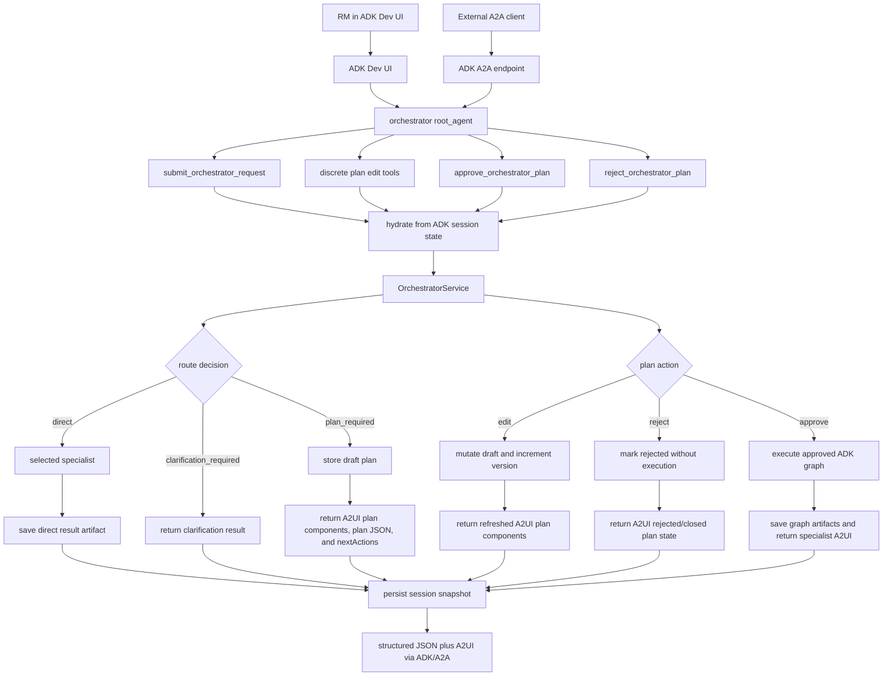

# PRD - ADK Dev UI and A2A Interface Migration

**Version:** 0.1  
**Date:** 2026-06-04  
**Status:** Draft for agentic harness implementation  
**Primary audience:** Internal engineering  
**Primary implementation language:** Python  
**Primary user:** Business Banking Relationship Manager  
**Primary interaction surface:** Google ADK Dev UI and Google ADK A2A protocol interfaces carrying A2UI plan components  
**Model access:** LiteLLM-compatible models, initially via OpenRouter runtime environment variables  
**Package/project manager:** `uv` only for dependency management, lockfile updates, virtual environment synchronization, quality gates, and command execution  

---

## 1. Product Summary

This migration will replace the project's custom local HTTP API and bespoke
static renderer with Google ADK-native interfaces while preserving A2UI as the
plan and approval presentation format.

The orchestrator's business behavior must remain intact: it still classifies
relationship-manager requests, routes simple requests directly, generates draft
plans for complex requests, supports human review of those plans, and executes
approved plans through ADK graph workflows. The interface changes are:

1. The default Google ADK Dev UI becomes the operator UI.
2. `adk api_server --a2a --with_ui` becomes the primary local runtime.
3. ADK A2A becomes the primary protocol surface for external agent clients.
4. Draft plans, plan edits, approval choices, rejection choices, and final
   specialist UI surfaces continue to be presented as A2UI component payloads,
   but those payloads travel through ADK Dev UI and A2A messages rather than the
   custom local renderer endpoints.
5. Pending approval state and execution artifacts are persisted through ADK
   session state and artifact services.

After the migrated interfaces are implemented and tested, the custom user-facing
endpoints `/api/request`, `/api/user-action`, `/api/status`,
`/api/status/stream`, and `/api/artifacts` are no longer supported. The static
renderer at `orchestrator_demo/app/static` is also removed from the supported
runtime path. This removes only the custom transport and renderer; it does not
remove A2UI component generation or A2UI-based plan review.

---

## 2. Background and Technical Basis

The current project already includes a stateful ADK root-agent adapter in
`orchestrator_demo/orchestrator/agent.py`, but the local demo still relies on a
custom standard-library HTTP server and a bespoke renderer for the full
request/action/status/artifact loop.

The installed ADK runtime supports the target replacement paths:

- `adk web` starts the default ADK Dev UI for local development and debugging.
- `adk api_server --a2a` exposes ADK agents through A2A protocol endpoints.
- `adk api_server --with_ui` can serve the default Dev UI from the API server.
- ADK `ToolContext` provides session state and artifact APIs that tools can use
  to persist data across turns when configured with a persistent session service.
- ADK's A2A integration can expose an ADK agent through an agent card and the
  standard A2A server rather than a project-specific HTTP contract.

Useful references:

- ADK Python quickstart and Dev UI: https://adk.dev/get-started/python/
- ADK A2A overview: https://adk.dev/a2a/
- ADK A2A exposing guide: https://adk.dev/a2a/quickstart-exposing/
- ADK A2A consuming guide: https://adk.dev/a2a/quickstart-consuming/
- ADK ToolContext and state: https://adk.dev/tools-custom/
- ADK context, state, and artifacts: https://adk.dev/context/

---

## 3. Goals

The migration must:

1. Make the Google ADK Dev UI the primary human operator surface.
2. Make ADK A2A the primary machine-to-machine protocol surface.
3. Preserve existing orchestrator routing, planning, approval, rejection, and
   graph-execution semantics.
4. Expose submit, plan edit, approve, and reject operations as ADK tools with
   stable names and structured JSON responses.
5. Add an A2A agent card so the orchestrator can be served by
   `adk api_server --a2a`.
6. Persist pending plan approval state through ADK session state.
7. Persist final outputs and graph execution summaries through ADK artifacts.
8. Preserve A2UI component generation for plan review, draft edits, approval,
   rejection, and specialist-owned downstream surfaces.
9. Remove the custom user-facing HTTP API and bespoke renderer after replacement
   tests pass.
10. Keep runtime-secret handling at least as strict as the current implementation.
11. Keep `uv` as the only supported project and command-execution path.

---

## 4. Non-goals

This migration will not:

1. Redesign request classification, direct routing, draft plan generation,
   approval validation, rejection behavior, or graph execution.
2. Replace local specialist implementations with production remote A2A agents.
3. Build a custom replacement web UI.
4. Remove A2UI as the plan and approval presentation format.
5. Add a production deployment target such as Cloud Run, GKE, or enterprise
   infrastructure.
6. Introduce a custom database beyond ADK session and artifact service
   configuration.
7. Implement a raw `a2a.server.agent_execution.AgentExecutor` unless ADK's
   built-in A2A bridge cannot pass the required integration tests.
8. Use natural-language chat text as approval for complex plans.
9. Store real customer data or secrets in sessions, artifacts, fixtures, logs,
   or A2A payloads.

---

## 5. Target Users and Use Cases

### 5.1 Primary user

The primary user remains a Business Banking Relationship Manager who needs help
preparing for customer meetings, researching prospects, reviewing relationship
context, and identifying engagement opportunities.

### 5.2 Primary operator journey - ADK Dev UI

Example request:

> Prepare me for tomorrow's meeting with ABC Manufacturing.

Expected behavior:

1. User opens the default ADK Dev UI.
2. User selects the `orchestrator` agent.
3. User asks the agent to submit the meeting-prep request.
4. The agent calls `submit_orchestrator_request`.
5. The tool returns and presents an A2UI approval-plan surface with `planId`,
   `planVersion`, step IDs, selected agents, dependencies, and next available
   edit/approve/reject actions.
6. User optionally asks the agent to edit the plan.
7. The agent calls one of the discrete plan edit tools.
8. The updated plan is re-presented as A2UI components through the ADK surface.
9. User asks the agent to approve or reject the plan.
10. The agent calls the corresponding approval tool.
11. If approved, the orchestrator freezes the plan, runs the ADK graph, stores
    artifacts, and returns final results.

### 5.3 Primary protocol journey - A2A client

Example request:

> Research this prospect and give me risks, opportunities, and talking points.

Expected behavior:

1. A2A client discovers the orchestrator through its agent card.
2. A2A client sends a text request to the orchestrator agent.
3. The ADK root agent uses its tools to produce structured JSON plus A2UI
   component payloads.
4. For complex requests, the first response includes an A2UI approval-plan
   surface, the pending draft plan data, and next actions.
5. A follow-up A2A message can request a specific edit, approval, or rejection.
6. Approved plans execute through the same internal graph runtime used today.

### 5.4 Direct-route journey

Example request:

> Summarize the internal notes for ABC Manufacturing.

Expected behavior:

1. User submits the request through ADK Dev UI or A2A.
2. The orchestrator classifies the request as direct.
3. The selected specialist runs without plan approval.
4. The response includes the specialist output, any specialist-owned A2UI
   components, and final artifacts.

---

## 6. Functional Requirements

### 6.1 ADK root agent

The package must expose an ADK-loadable `root_agent` for the `orchestrator`
agent. The root agent must be loadable by ADK's agent loader from the
`orchestrator_demo` package.

The root agent must use the current runtime model bootstrap path for live runs,
while tests may inject a deterministic model or adapter.

The root agent instruction must clearly guide the model to:

- call tools for all orchestrator operations,
- never treat natural-language approval as execution approval,
- show users the `planId`, `planVersion`, and step IDs required for follow-up
  tool calls,
- use edit tools before approval when the user requests changes,
- use approve/reject tools only when the user explicitly requests those actions.

### 6.2 ADK tools

The root agent must expose these stable tool names:

| Tool name | Purpose |
| --- | --- |
| `submit_orchestrator_request` | Submit a new natural-language RM request. |
| `add_plan_instruction` | Add a user instruction to one draft plan step. |
| `remove_plan_step` | Remove one draft plan step when allowed by plan invariants. |
| `replace_plan_agent` | Replace the agent assigned to one draft plan step. |
| `reorder_plan_steps` | Reorder the current draft plan steps. |
| `approve_orchestrator_plan` | Approve a current draft plan and execute its graph. |
| `reject_orchestrator_plan` | Reject a current draft plan without execution. |

All tools must return JSON-serializable dictionaries. Tool return payloads must
use stable camelCase keys for user-facing protocol fields where practical.

Required common fields for tool responses:

```json
{
  "status": "plan_required",
  "path": "plan_required",
  "planId": "plan_example",
  "planVersion": 1,
  "approvalSurfaceId": "surface_plan_example",
  "plan": {},
  "a2uiParts": [],
  "nextActions": [],
  "statusEvents": [],
  "artifacts": {}
}
```

Fields that are not relevant to a response may be omitted or set to `null`, but
the response shape must remain deterministic enough for tests and A2A clients to
parse.

Tool responses for plan-required and draft-updated states must include A2UI
component payloads in `a2uiParts` so the plan can be rendered through ADK-native
UI/protocol paths. These payloads must be standard A2UI data parts or ADK UI
rendering outputs, not custom `/api/*` renderer messages. JSON plan fields are
still required so A2A clients can inspect and act on the plan even when they do
not render A2UI.

### 6.3 A2UI presentation requirements

A2UI remains the required presentation layer for:

- initial draft plan review,
- draft plan refresh after edits,
- approval and rejection controls,
- downstream specialist-owned UI payloads,
- final artifact summaries when an A2UI layout is useful.

The implementation must deliver A2UI through Google ADK paths:

- In ADK Dev UI, use ADK-supported UI rendering mechanisms, such as
  `ToolContext.render_ui_widget` when available for the payload shape.
- In A2A protocol responses, carry A2UI as `DataPart` payloads with
  `metadata.mimeType` set to `application/json+a2ui`.

The custom static renderer must not be required to see or interact with draft
plans. If a client cannot render A2UI, the structured JSON plan fields must
remain sufficient for the client to issue edit, approve, or reject tool calls.

### 6.4 Submit request behavior

`submit_orchestrator_request(user_input, tool_context)` must:

1. Hydrate the orchestrator session snapshot from ADK session state.
2. Call `OrchestratorService.handle_user_request`.
3. Return direct, plan-required, or clarification-required results.
4. Persist the updated orchestrator snapshot to `tool_context.state`.
5. Save final artifacts through `tool_context.save_artifact` when the request
   completes without a pending approval.
6. Emit A2UI component payloads for any plan-required result and for any
   specialist response that includes specialist-owned A2UI.

For a complex `plan_required` response, the tool must return:

- `planId`
- `planVersion`
- `approvalSurfaceId`
- selected agents
- step IDs
- step instructions
- dependencies
- risk notes
- A2UI approval-plan components
- next action hints for edit, approve, and reject tools

### 6.5 Draft edit behavior

The discrete edit tools must map to existing structured plan mutations:

| Tool | Internal user action |
| --- | --- |
| `add_plan_instruction` | `add_instruction` |
| `remove_plan_step` | `remove_step` |
| `replace_plan_agent` | `replace_agent` |
| `reorder_plan_steps` | `reorder_steps` |

Each edit tool must require:

- `plan_id`
- `approval_surface_id`
- `edited_plan_version`

Each edit tool must synthesize the structured `userAction` envelope expected by
`OrchestratorService.handle_user_action`.

Successful edits must:

1. Apply the mutation through existing approval state logic.
2. Return `status: "draft_updated"`.
3. Return the updated plan and incremented `planVersion`.
4. Return refreshed A2UI plan components for the updated draft.
5. Persist the updated orchestrator snapshot to ADK session state.
6. Not execute the graph.
7. Not call specialists.

Failed edits must preserve the prior draft and return or raise an error that
does not include secrets.

### 6.6 Approval behavior

`approve_orchestrator_plan` must require:

- `plan_id`
- `approval_surface_id`
- `approved_step_ids`
- `edited_plan_version`

The tool must synthesize the same structured `approve_plan` event currently
used by approval state.

Successful approval must:

1. Freeze the current draft plan.
2. Execute the approved ADK graph.
3. Return `status: "approved"`.
4. Return graph status events.
5. Return final artifacts.
6. Return any specialist-owned A2UI components produced during execution.
7. Save final artifacts through ADK artifact storage.
8. Persist updated session state.

Approval must fail when the plan version is stale, the approved step IDs do not
match the current draft, the plan is already final, or specialist handlers are
unavailable.

### 6.7 Rejection behavior

`reject_orchestrator_plan` must require:

- `plan_id`
- `approval_surface_id`
- `reason`

The tool should accept `edited_plan_version` and validate it when supplied.

Successful rejection must:

1. Set the approval record to `rejected`.
2. Return `status: "rejected"`.
3. Return the rejection reason.
4. Return `graphCreated: false`.
5. Return `specialistsCalled: false`.
6. Return an A2UI update that closes or marks the approval plan as rejected
   through the ADK/A2A presentation path.
7. Persist updated session state.
8. Not execute the graph.
9. Not call specialists.

### 6.8 A2A exposure

The project must include an A2A agent card for the orchestrator.

Required agent card properties:

```json
{
  "name": "orchestrator",
  "description": "Business banking relationship-manager orchestrator for request routing, draft plan review, plan approval, and approved graph execution.",
  "version": "0.1.0",
  "defaultInputModes": ["text/plain"],
  "defaultOutputModes": ["application/json", "application/json+a2ui", "text/plain"],
  "capabilities": {
    "streaming": true,
    "stateTransitionHistory": true
  },
  "skills": []
}
```

The card must include skills for:

- request submission,
- draft plan editing,
- draft plan approval,
- draft plan rejection,
- A2UI plan review.

The default local URL should match the documented local command:

```text
http://127.0.0.1:8000/a2a/orchestrator
```

Tests may override host and port.

### 6.9 Standard runtime command

The primary local runtime command must be:

```bash
uv run adk api_server --a2a --with_ui orchestrator_demo --host 0.0.0.0 --port 8000 --session_service_uri sqlite:///.adk/orchestrator_sessions.sqlite --artifact_service_uri file:./.adk/artifacts
```

`uv run adk web orchestrator_demo --host 0.0.0.0 --port 8000` may remain
documented as a Dev UI-only debugging command, but it is not the primary runtime
because it does not by itself express the full A2A migration target.

### 6.10 Removal of custom endpoints and renderer

After the ADK Dev UI and A2A interfaces pass acceptance tests:

1. Remove `python -m orchestrator_demo.app` as a supported runtime path.
2. Remove or archive `LocalOrchestratorApp`, `LocalHttpServer`, and the custom
   request handler.
3. Remove the custom static renderer assets from the supported app surface while
   retaining A2UI payload generation and validation.
4. Remove README sections that advertise `/api/request`, `/api/user-action`,
   `/api/status`, `/api/status/stream`, `/api/artifacts`, and `GET /`.
5. Replace custom transport tests with ADK and A2A integration tests.

If implementation chooses to keep a small internal compatibility helper for
tests, it must not be documented as a user-facing runtime interface.

---

## 7. State and Artifact Requirements

### 7.1 Session state

The migrated adapter must persist pending orchestrator state in ADK session
state using a single namespaced key:

```text
orchestrator_session
```

The value must be JSON serializable and must not include secrets.

Minimum snapshot contents:

- pending approval records,
- current draft plans,
- approved or rejected plan metadata,
- request context data required for approval guardrails,
- surface ownership data required to route synthesized plan actions,
- latest artifact names or references.

### 7.2 Service hydration

Every ADK tool call must:

1. Load `orchestrator_session` from `tool_context.state`.
2. Rehydrate a service or service-backed state container.
3. Execute the requested operation.
4. Persist the updated snapshot back to `tool_context.state`.

This must allow a user to submit a plan in one Dev UI turn and approve it in a
later turn, including after adapter object recreation, as long as the ADK session
service is persistent.

### 7.3 Artifact storage

Approved graph execution results and direct-route final outputs must be saved
through ADK artifacts.

Required artifact names:

- `orchestrator_latest_result.json`
- `orchestrator_plan_<plan_id>_execution.json` for approved complex plans

Artifact payloads must be JSON documents stored as ADK `Part` content and must
not contain secrets.

### 7.4 Persistence mode

The documented local command must use:

- SQLite session storage for session continuity.
- File artifact storage for final outputs.

The implementation may use in-memory ADK services in tests when those tests
explicitly validate behavior within a single process.

---

## 8. Request Flow



---

## 9. Security and Safety Requirements

The migration must preserve existing safety properties:

1. Runtime secrets must come from environment variables or local `.env`.
2. Secrets must not be logged.
3. Secrets must not be written to session state.
4. Secrets must not be written to artifacts.
5. Secrets must not appear in A2A messages, tool responses, or test fixtures.
6. Plan approval must remain structured and explicit.
7. Natural-language chat must not count as approval.
8. Complex-route specialist calls must remain blocked until a plan is approved.
9. Stale plan-version approval and edit attempts must fail.
10. Approved and rejected plans must remain immutable.

The project must continue to avoid regulated or binding financial decisions.

---

## 10. Testing Requirements

### 10.1 ADK root-agent tests

Tests must verify:

- ADK can load the `orchestrator` root agent from `orchestrator_demo`.
- The root agent exposes exactly the expected tool names.
- Tool responses are JSON serializable.
- Plan-required and draft-updated tool responses include A2UI payloads.
- A2UI payloads use ADK/A2A-compatible data parts and not custom `/api/*`
  renderer transport.

### 10.2 Tool flow tests

Tests must cover:

1. Submit direct request and receive specialist output.
2. Submit complex request and receive a pending draft plan plus A2UI approval
   components.
3. Submit complex request, add instruction, approve, and receive final result.
4. Submit complex request, remove or replace a step when valid, approve, and
   receive final result.
5. Submit complex request, reject, and verify no graph execution occurred.
6. Attempt approval with stale `edited_plan_version` and receive a safe error.
7. Attempt approval with mismatched `approved_step_ids` and receive a safe error.

### 10.3 ADK session and artifact tests

Tests must verify:

- A pending plan survives adapter or service object recreation when session
  state is carried forward.
- Approval after rehydration executes the correct draft plan.
- Final artifacts are saved with the required artifact names.
- Session state and artifact payloads do not contain known test secret strings.

### 10.4 A2A integration tests

Tests must verify:

- `adk api_server --a2a --with_ui` starts for the `orchestrator_demo` package.
- The orchestrator agent card is fetchable.
- The agent card advertises expected skills and output modes, including
  `application/json+a2ui`.
- An A2A client can submit a text request and receive a structured result with
  A2UI parts for complex plan review.
- A2A responses do not contain known test secret strings.

### 10.5 Removal and hygiene tests

Tests must verify:

- README no longer documents custom `/api/*` endpoints as the supported runtime.
- Static renderer tests are removed or replaced.
- Custom transport endpoint tests are removed or replaced.
- Project dependency management remains `uv` only.

### 10.6 Quality gates

The implementation must pass:

```bash
uv run pytest
uv run ruff check .
uv run mypy orchestrator_demo
```

---

## 11. Acceptance Criteria

The migration is complete when:

1. `uv run adk api_server --a2a --with_ui orchestrator_demo ...` starts
   successfully.
2. The default ADK Dev UI can submit a request to the orchestrator agent.
3. Complex requests present an A2UI draft plan surface and return structured
   draft plan JSON with next actions.
4. The ADK Dev UI can drive A2UI-backed edit, approve, and reject flows through
   tools.
5. A2A clients can discover the orchestrator through the agent card.
6. A2A clients can submit requests and receive structured results plus A2UI
   `DataPart` payloads when plan or specialist UI is available.
7. Pending draft plans can be approved after session-backed rehydration.
8. Approved graph execution stores final artifacts through ADK artifacts.
9. Custom `/api/*` endpoints and the custom renderer are no longer documented or
   required for the main demo.
10. All required tests and quality gates pass.

---

## 12. Implementation Notes for the Agentic Harness

Recommended implementation sequence:

1. Extend the ADK adapter with discrete edit tools, normalized JSON response
   builders, and ADK/A2A A2UI payload delivery.
2. Add session snapshot serialization and hydration around tool calls.
3. Add artifact save/load helpers.
4. Adapt approval canvas delivery from the bespoke renderer contract to ADK
   Dev UI/A2A-compatible A2UI delivery.
5. Add the A2A `agent.json`.
6. Update README runtime instructions.
7. Add ADK tool, A2UI delivery, and persistence tests.
8. Add A2A server integration tests.
9. Remove or replace custom app transport and renderer tests.
10. Remove unsupported custom API/runtime documentation.

Implementation should prefer small, testable changes and should not refactor the
core router, planner, approval store, or graph runtime except where explicit
snapshot serialization requires narrow helper APIs.

---

## 13. Open Risks

1. ADK A2A integration behavior may differ across `google-adk` versions. Tests
   must pin behavior against the installed lockfile version.
2. Persisting full request context through JSON may require explicit snapshot
   helpers rather than direct dataclass serialization.
3. ADK Dev UI and A2A clients may differ in how they render A2UI payloads. The
   implementation must preserve structured JSON fallbacks while still emitting
   A2UI as the primary presentation payload.
4. Removing the custom renderer may require test rewrites across multiple files.
