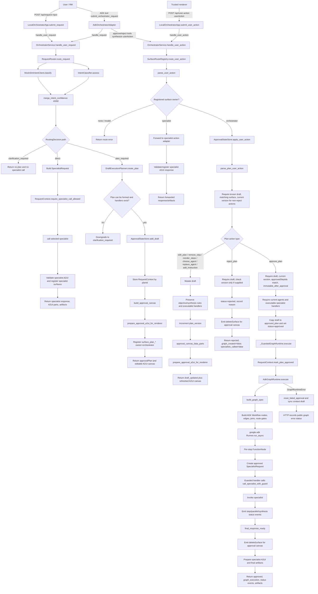

# Orchestrator Request Flow

This document traces how requests move through the demo orchestrator to route
direct work, generate draft plans, edit draft plans, reject plans, and approve
plans for ADK graph execution.

## Primary Modules

- `orchestrator_demo/app/server.py`: local HTTP ingress, renderer replay cache,
  public request/action/status/artifact payloads.
- `orchestrator_demo/orchestrator/agent.py`: ADK Web facade that exposes request,
  approve, and reject operations as tools.
- `orchestrator_demo/orchestrator/service.py`: central application service that
  wires routing, planning, approval state, A2UI registration, and graph execution.
- `orchestrator_demo/orchestrator/router.py`: SLM/LLM intent assessment merge and
  route decision logic.
- `orchestrator_demo/orchestrator/planner.py`: deterministic draft plan creation
  for `plan_required` decisions.
- `orchestrator_demo/orchestrator/approval_state.py`: draft, edit, approval, and
  rejection state machine.
- `orchestrator_demo/orchestrator/surface_routes.py`: deterministic A2UI
  `surfaceId` ownership and userAction routing.
- `orchestrator_demo/orchestrator/request_context.py`: pre-approval guardrails
  that block specialist calls until an approved plan has been frozen.
- `orchestrator_demo/orchestrator/graph_runtime.py`: approved-plan graph spec
  creation, ADK workflow execution, specialist invocation, and progress events.
- `orchestrator_demo/a2ui_support/approval_canvas.py`: approval canvas generation.
- `orchestrator_demo/a2ui_support/renderer_contract.py`: outbound A2UI validation
  and surface ownership registration.
- `orchestrator_demo/a2ui_support/event_parser.py`: structured userAction parsing
  and normalization.

## Flow Diagram

## Request Classification And Routing

The central service entrypoint is `OrchestratorService.handle_user_request`.
It delegates classification to `RequestRouter.route_request`, which gathers a
lightweight SLM suggestion, asks the stronger intent classifier for a structured
assessment, merges confidence with fixed `0.4` SLM and `0.6` LLM weights, and
then chooses one of three paths.

`direct` is intentionally narrow: the request must be simple, single-intent,
single-agent, high confidence, non-sensitive, and must not require synthesis.
Sensitive intents and agents such as `credit_risk` and `compliance_policy`
force the request out of direct routing. If required agents are unavailable, or
if only synthesis would remain after filtering, the route becomes
`clarification_required`.

## Draft Plan Generation

For `plan_required`, `DraftExecutionPlanner.create_plan` converts the routing
assessment into an `ExecutionPlan`. It filters required agents against the live
registry, appends `synthesis` when the request is complex or multi-workstream,
moves synthesis to the end, and creates request-scoped IDs:

- `plan_<intent_or_agent>_<plan_scope_id>`
- `surface_<plan_id>`
- `step_<agent_id>`

Plan steps are built with deterministic instructions, expected outputs, data
source categories, dependencies, and parallel groups. Synthesis depends on all
non-synthesis steps, so the default multi-agent shape is fan-out/fan-in.

The service performs an additional handler preflight before publishing the
draft. If planning or handler availability fails, the service rewrites the
decision to `clarification_required`. If it succeeds, the service stores the
draft in `ApprovalStateStore`, stores the matching `RequestContext` by `plan_id`,
builds the approval canvas, validates the outbound A2UI, and registers the
approval surface as orchestrator-owned.

## A2UI Action Routing

All renderer actions enter `OrchestratorService.handle_user_action`. The service
does not infer ownership with an LLM. `SurfaceRouteRegistry.route_user_action`
parses the action, looks up `surfaceId`, and either:

- returns an error for malformed or unknown surfaces,
- forwards the event to the registered specialist adapter,
- or returns `orchestrator_owned` for approval surfaces.

Specialist surfaces cannot claim the reserved `surface_plan_` prefix, and a
surface cannot be re-registered under a conflicting owner. This is what prevents
specialist UI from hijacking approval-plan events.

## Draft Editing

Plan-owned user actions are parsed again with `parse_plan_user_action`, which
requires a reserved approval surface, a supported plan action type, `planId`, and
`planVersion` for every non-reject action.

Supported draft mutations are:

- `edit_plan`
- `remove_step`
- `reorder_steps`
- `choose_agent`
- `replace_agent`
- `add_instruction`
- `add_instructions`

Before any mutation applies, `ApprovalStateStore` requires the plan to still be
in `draft`, the surface to match the draft approval surface, and the submitted
version to equal the current draft version. The mutation must keep the plan
executable, keep at least one non-synthesis workstream, and preserve exactly one
final synthesis step when the original plan required synthesis. Successful edits
increment `plan_version`, store the new draft, refresh the approval canvas, and
return `draft_updated`. No graph is created and no specialist is called.

## Rejection

`reject_plan` requires the plan to still be a draft and records the optional
reason. Unlike approval and edit actions, a reject action may omit plan version;
if it supplies one, the store checks it against the current draft version.

Rejection sets the stored record to `rejected`, logs `approval_rejected`, returns
`graph_created=false` and `specialists_called=false`, and the service emits a
`deleteSurface` update for the approval canvas. No ADK graph is built and no
specialist is called.

## Approval And Execution

`approve_plan` is the only path that freezes and executes a complex plan. The
approval store requires:

- the record is still `draft`,
- the submitted version matches the current draft version,
- `approvedStepIds` exactly match the current draft steps,
- `immutable_after_approval=True`,
- all referenced agents still exist,
- executable specialist handlers are available.

After those checks, the draft is deep-copied into `approved_plan`, the record is
marked `approved`, and `_GuardedGraphRuntime` starts execution. Before the ADK
runtime can invoke specialists, the matching `RequestContext` is marked approved
with immutable per-step payloads. Those payloads become the guardrail contract:
each complex-route specialist request must use the approved `plan_id`, approved
`step_id`, approved agent, approved instruction, and approved static context.

`AdkGraphRuntime.execute` converts the approved plan to a `GraphSpec`, creates
ADK `FunctionNode`, `JoinNode`, and `Edge` objects, runs the workflow with an
ADK `Runner`, captures per-step specialist requests and responses, emits status
events, and returns final graph execution data. The service then deletes the
approval surface, validates and registers any specialist A2UI surfaces, and
returns final artifacts.

If graph execution fails, the approval store records an
`approved_execution_failed` state, the service resets that failed approval back
to an editable draft with `reset_failed_approval`, re-syncs the request context,
and the HTTP layer records public graph error status.

